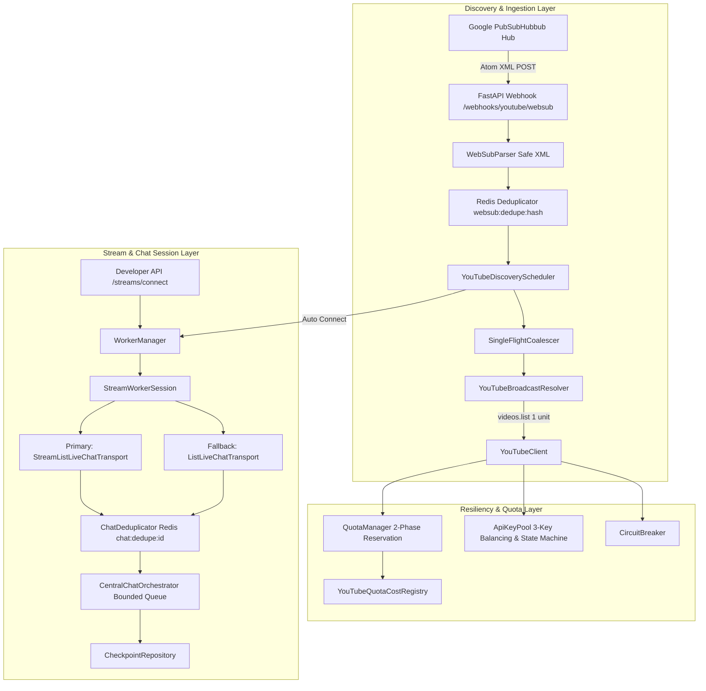

# YouTube Engine Architecture (Phase 2)

## 1. System Overview

The Phase 2 YouTube Engine is an asynchronous, high-throughput, fault-tolerant ingestion, discovery, and transport subsystem built specifically for `GODDESS AI / AI-MODRATOR`.

---

## 2. Core Architectural Components

### 2.1 Quota Optimization & Two-Phase Reservation
- **`YouTubeQuotaCostRegistry`**: Centralizes official YouTube Data API v3 costs (e.g. `videos.list=1`, `channels.list=1`, `liveChatMessages.list=1`, `liveChatMessages.streamList=1`, `search.list=100`). Prohibits expensive `search.list` calls.
- **Two-Phase Reservation**:
  1. `reserve(units)`: Verifies daily safety limit (`YOUTUBE_QUOTA_DAILY_LIMIT=4000`) and reserves quota atomically in memory/Redis before request dispatch.
  2. `release_if_not_dispatched()`: Refunds reservation if client encounters local validation failure prior to wire dispatch.
  3. `consume()` or `record_failure()`: Commits quota units upon wire delivery or conservative HTTP failure charging.

### 2.2 3-Key API Pool & Dynamic Health State Machine
- **Key Slots**: Supports `key_1`, `key_2`, `key_3` (`YOUTUBE_API_KEY_1`, `2`, `3`).
- **State Transitions**:
  - `AVAILABLE`: Ready for dispatch. Least-used balancing ensures uniform key wear.
  - `COOLDOWN`: Temporary 5xx or transient 429 backoff ($T_{cooldown} = 30s \times 2^{failures}$, capped at 15m).
  - `EXHAUSTED`: Permanent 403 `quotaExceeded` status until UTC midnight reset.
  - `INVALID`: Permanent 400 `keyInvalid` error.

### 2.3 Single-Flight Request Coalescing
- **`SingleFlightCoalescer`**: Eliminates duplicate in-flight API requests across concurrent stream sessions. When 10 concurrent requests target the same `video_id`, only 1 executes against the network while 9 await the shared leader's future.

### 2.4 WebSub Subsystem (PubSubHubbub)
- **Zero-Polling Discovery**: Automated subscription to YouTube Channel Atom feeds via Google PubSubHubbub hub (`https://pubsubhubbub.appspot.com/subscribe`).
- **Security & XML Sanitization**: `WebSubParser` strictly rejects external entity expansion, DTDs, and payloads exceeding 1MB.
- **Deduplication**: Redis 24-hour hash deduplication (`websub:dedupe:{hash}`).

### 2.5 Dual Live Chat Transports & Orchestration
- **Primary Transport**: `StreamListLiveChatTransport` uses long-lived server-streaming HTTP connections for sub-second chat latency.
- **Fallback Transport**: `ListLiveChatTransport` uses adaptive polling intervals (`pollingIntervalMillis`) and handles token refreshes.
- **`CentralChatOrchestrator`**: Bounded `asyncio.Queue(maxsize=1000)` backpressure per session, preventing memory leaks during chat message spikes.
